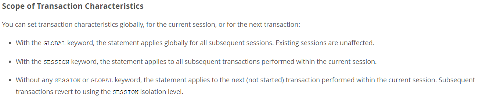

#### 四种隔离级别的解释

SQL标准定义了4类隔离级别，包括了一些具体规则，用来限定事务内外的哪些改变是可见的，哪些是不可见的。低级别的隔离级一般支持更高的并发处理，并拥有更低的系统开销。

<!--more-->

*   Read Uncommitted（读取未提交内容）

在该隔离级别，所有事务都可以看到其他未提交事务的执行结果。本隔离级别很少用于实际应用，因为它的性能也不比其他级别好多少。读取未提交的数据，也被称之为**脏读（Dirty Read**）。

*   Read Committed（读取提交内容）

这是大多数数据库系统的默认隔离级别（但不是MySQL默认的）。它满足了隔离的简单定义：一个事务只能看见已经提交事务所做的改变。这种隔离级别 也支持所谓的**不可重复读（Nonrepeatable Read**），因为同一事务的其他实例在该实例处理其间可能会有新的commit，所以同一select可能返回不同结果。

*   Repeatable Read（可重读）

**这是MySQL的默认事务隔离级别**，它确保同一事务的多个实例在并发读取数据时，会看到同样的数据行。不过理论上，这会导致另一个棘手的问题：**幻读 （Phantom Read**）。简单的说，幻读指当用户读取某一范围的数据行时，另一个事务又在该范围内插入了新行，当用户再读取该范围的数据行时，会发现有新的"幻影" 行。**InnoDB和Falcon存储引擎通过多版本并发控制（MVCC，Multiversion Concurrency Control）机制解决了该问题**。

*   Serializable（可串行化）

这是最高的隔离级别，它通过强制事务排序，使之不可能相互冲突，从而解决幻读问题。简言之，它是在每个读的数据行上加上共享锁。在这个级别，可能导致大量的超时现象和锁竞争。

#### 不同隔离级别带来的问题

这四种隔离级别采取不同的锁类型来实现，若读取的是同一个数据的话，就容易发生问题。例如：

**脏读(Drity Read)**：某个事务已更新一份数据，另一个事务在此时读取了同一份数据，由于某些原因，前一个RollBack了操作，则后一个事务所读取的数据就会是不正确的。

**不可重复读(Non-repeatable read)**:在一个事务的两次查询之中数据不一致，这可能是两次查询过程中间插入了一个事务更新的原有的数据。

**幻读(Phantom Read)**:在一个事务的两次查询中数据行数不一致，例如有一个事务查询了几列行Row)数据，而另一个事务却在此时插入了新的几行数据，先前的事务在接下来的查询中，就会发现有几行数据是它先前所没有的。 （Mysql的InnoDB和Falcon存储引擎通过多版本并发控制（MVCC，Multiversion Concurrency Control）机制解决了该问题。）

在MySQL中，实现了这四种隔离级别，分别有可能产生问题如下所示：

#### MySQL 中如何更新事务级别:

    SELECT @@GLOBAL.tx_isolation, @@tx_isolation;
    SET GLOBAL tx_isolation='REPEATABLE-READ';
    SET SESSION tx_isolation='SERIALIZABLE';

    or

    SET SESSION TRANSACTION ISOLATION LEVEL READ UNCOMMITTED
    SET SESSION TRANSACTION ISOLATION LEVEL SERIALIZABLE
    SET SESSION TRANSACTION ISOLATION LEVEL REPEATABLE READ

    整个语法是：

    SET [GLOBAL ' SESSION] TRANSACTION
        transaction_characteristic [, transaction_characteristic] ...

    transaction_characteristic:
        ISOLATION LEVEL level
      ' READ WRITE
      ' READ ONLY

    level:
         REPEATABLE READ
       ' READ COMMITTED
       ' READ UNCOMMITTED
       ' SERIALIZABLE

`但是两种修改方式效果是不一样的`

举例子：mysql打开两个客户端A、B，在A客户端修改事务隔离

> 使用global 修改，那么A和B下次重新登录的时候显示修改后的效果
> 使用session形式的设置，当前的会话会立即生效，重新登录后不会生效

详见: MySQL 官方文档: [http://dev.mysql.com/doc/refman/5.0/en/set-transaction.html](http://dev.mysql.com/doc/refman/5.0/en/set-transaction.html)

#### 实验

下面，将利用MySQL的客户端程序，分别测试几种隔离级别。测试数据库为test，表为tx；
表结构：

    CREATE TABLE `tx` (
      `id` int(10) NOT NULL AUTO_INCREMENT,
      `num` int(10) DEFAULT NULL,
      PRIMARY KEY (`id`)
    ) ENGINE=InnoDB

两个命令行客户端分别为A，B；不断改变A的隔离级别，在B端修改数据。

以下每次测试前初始数据为：

    mysql> select * from test.tx;
    +----+------+
    ' id ' num  '
    +----+------+
    '  1 '    1 '
    '  2 '    2 '
    '  3 '    3 '
    '  4 '    4 '
    +----+------+
    4 rows in set (0.00 sec)

（一）、将A的隔离级别设置为read uncommitted(未提交读)

*   在B未更新数据之前：
客户端A：

    mysql> select * from test.tx;
    +----+------+
    ' id ' num  '
    +----+------+
    '  1 '    1 '
    '  2 '    2 '
    '  3 '    3 '
    '  4 '    4 '
    +----+------+
    4 rows in set (0.00 sec)

    mysql> select @@tx_isolation;
    +------------------+
    ' @@tx_isolation   '
    +------------------+
    ' READ-UNCOMMITTED '
    +------------------+
    1 row in set (0.00 sec)

    mysql>

*   B更新数据：
客户端B：

    mysql> select @@tx_isolation;
    +-----------------+
    ' @@tx_isolation  '
    +-----------------+
    ' REPEATABLE-READ '
    +-----------------+
    1 row in set (0.00 sec)

    mysql> start transaction;
    Query OK, 0 rows affected (0.00 sec)

    mysql> update tx set num=10 where id=3;
    Query OK, 1 row affected (0.00 sec)
    Rows matched: 1  Changed: 1  Warnings: 0

    mysql> select * from tx;
    +----+------+
    ' id ' num  '
    +----+------+
    '  1 '    1 '
    '  2 '    2 '
    '  3 '   10 '
    '  4 '    4 '
    +----+------+
    4 rows in set (0.00 sec)

    mysql>

这个时候查看A客户端的数据:

    mysql> select * from test.tx;
    +----+------+
    ' id ' num  '
    +----+------+
    '  1 '    1 '
    '  2 '    2 '
    '  3 '   10 '
    '  4 '    4 '
    +----+------+
    4 rows in set (0.00 sec)

    mysql>

客户端B的事务没有进行commit，但是已经可以在A客户端查看到更新的数据，这个时候就出现了`脏读`

接下来将B事务进行回滚

    mysql> rollback;
    Query OK, 0 rows affected (0.01 sec)

    mysql> select * from tx;
    +----+------+
    ' id ' num  '
    +----+------+
    '  1 '    1 '
    '  2 '    2 '
    '  3 '    3 '
    '  4 '    4 '
    +----+------+
    4 rows in set (0.00 sec)

    mysql>

再进行查看A客户端的数据

    mysql> select * from test.tx;
    +----+------+
    ' id ' num  '
    +----+------+
    '  1 '    1 '
    '  2 '    2 '
    '  3 '    3 '
    '  4 '    4 '
    +----+------+
    4 rows in set (0.00 sec)

    mysql>

        经过上面的实验可以得出结论，事务B更新了一条记录，但是没有提交，此时事务A可以查询出未提交记录。造成脏读现象。未提交读是最低的隔离级别。

（二）、将客户端A的事务隔离级别设置为read committed(已提交读)

    mysql> SET SESSION TRANSACTION ISOLATION LEVEL READ COMMITTED;
    Query OK, 0 rows affected (0.00 sec)

    mysql>

在B未更新数据之前：
客户端A：

    mysql> select @@tx_isolation;
    +----------------+
    ' @@tx_isolation '
    +----------------+
    ' READ-COMMITTED '
    +----------------+
    1 row in set (0.00 sec)

    mysql> select * from test.tx;
    +----+------+
    ' id ' num  '
    +----+------+
    '  1 '    1 '
    '  2 '    2 '
    '  3 '    3 '
    '  4 '    4 '
    +----+------+
    4 rows in set (0.00 sec)

    mysql> start transaction;
    Query OK, 0 rows affected (0.00 sec)

    mysql>

B更新数据：
客户端B：

    mysql> select * from tx;
    +----+------+
    ' id ' num  '
    +----+------+
    '  1 '    1 '
    '  2 '    2 '
    '  3 '    3 '
    '  4 '    4 '
    +----+------+
    4 rows in set (0.00 sec)

    mysql> start transaction;
    Query OK, 0 rows affected (0.00 sec)

    mysql> select * from tx;
    +----+------+
    ' id ' num  '
    +----+------+
    '  1 '    1 '
    '  2 '    2 '
    '  3 '    3 '
    '  4 '    4 '
    +----+------+
    4 rows in set (0.00 sec)

    mysql> update tx set num=10 where id=3;
    Query OK, 1 row affected (0.00 sec)
    Rows matched: 1  Changed: 1  Warnings: 0

    mysql> select * from tx;
    +----+------+
    ' id ' num  '
    +----+------+
    '  1 '    1 '
    '  2 '    2 '
    '  3 '   10 '
    '  4 '    4 '
    +----+------+
    4 rows in set (0.00 sec)

    mysql>

这个时候查看客户端A：

    mysql> select * from test.tx;
    +----+------+
    ' id ' num  '
    +----+------+
    '  1 '    1 '
    '  2 '    2 '
    '  3 '    3 '
    '  4 '    4 '
    +----+------+
    4 rows in set (0.00 sec)

    mysql>

接下来我们commit事务，然后查询A数据，发现能够查询到数据了（但是A还没有commit）：

    mysql> select * from test.tx;
    +----+------+
    ' id ' num  '
    +----+------+
    '  1 '    1 '
    '  2 '    2 '
    '  3 '   10 '
    '  4 '    4 '
    +----+------+
    4 rows in set (0.00 sec)

    mysql>

       经过上面的实验可以得出结论，已提交读隔离级别解决了脏读的问题，但是出现了不可重复读的问题，即事务A在两次查询的数据不一致，因为在两次查询之间事务B更新了一条数据。已提交读只允许读取已提交的记录，但不要求可重复读。

(三)、将A的隔离级别设置为repeatable read(可重复读)
在B未更新数据之前：
客户端A：

    mysql> select * from test.tx;
    +----+------+
    ' id ' num  '
    +----+------+
    '  1 '    1 '
    '  2 '    2 '
    '  3 '    3 '
    '  4 '    4 '
    +----+------+
    4 rows in set (0.00 sec)

    mysql> start transaction;
    Query OK, 0 rows affected (0.00 sec)

B更新数据：
客户端B：

    mysql> start transaction;
    Query OK, 0 rows affected (0.00 sec)
    mysql> select * from tx;
    +----+------+
    ' id ' num  '
    +----+------+
    '  1 '    1 '
    '  2 '    2 '
    '  3 '    3 '
    '  4 '    4 '
    +----+------+
    4 rows in set (0.00 sec)

    mysql> update tx set num=10 where id=3;
    Query OK, 1 row affected (0.00 sec)
    Rows matched: 1  Changed: 1  Warnings: 0

    mysql> select * from tx;
    +----+------+
    ' id ' num  '
    +----+------+
    '  1 '    1 '
    '  2 '    2 '
    '  3 '   10 '
    '  4 '    4 '
    +----+------+
    4 rows in set (0.00 sec)

客户端A：

    mysql> select * from test.tx;
    +----+------+
    ' id ' num  '
    +----+------+
    '  1 '    1 '
    '  2 '    2 '
    '  3 '    3 '
    '  4 '    4 '
    +----+------+
    4 rows in set (0.00 sec)

    mysql>

B插入数据：
客户端B：

    mysql> insert tx set num = 5;
    Query OK, 1 row affected (0.00 sec)

    mysql> select * from tx;
    +----+------+
    ' id ' num  '
    +----+------+
    '  1 '    1 '
    '  2 '    2 '
    '  3 '   10 '
    '  4 '    4 '
    '  5 '    5 '
    +----+------+
    5 rows in set (0.00 sec)

    mysql>

客户端A：

    mysql> select * from test.tx;
    +----+------+
    ' id ' num  '
    +----+------+
    '  1 '    1 '
    '  2 '    2 '
    '  3 '    3 '
    '  4 '    4 '
    +----+------+
    4 rows in set (0.00 sec)

       由以上的实验可以得出结论，可重复读隔离级别只允许读取已提交记录，而且在一个事务两次读取一个记录期间，其他事务部的更新该记录。但该事务不要求与其他事务可串行化。例如，当一个事务可以找到由一个已提交事务更新的记录，但是可能产生幻读问题(注意Mysql的InnoDB 和 Falcon存储引擎通过多版本并发控制（MVCC，Multiversion Concurrency Control）机制解决了该问题)。

(四)、将A的隔离级别设置为 可串行化 (Serializable)
A端打开事务，B端插入一条记录
事务A端：

    mysql> SET SESSION TRANSACTION ISOLATION LEVEL SERIALIZABLE;
    Query OK, 0 rows affected (0.00 sec)

    mysql> select * from test.tx;
    +----+------+
    ' id ' num  '
    +----+------+
    '  1 '    1 '
    '  2 '    2 '
    '  3 '    3 '
    '  4 '    4 '
    +----+------+
    4 rows in set (0.00 sec)

    mysql> start transaction;
    Query OK, 0 rows affected (0.00 sec)

    mysql>

事务B端：

    mysql> update tx set num=10 where id=3;
    Query OK, 1 row affected (0.01 sec)
    Rows matched: 1  Changed: 1  Warnings: 0

    mysql> select * from tx;
    +----+------+
    ' id ' num  '
    +----+------+
    '  1 '    1 '
    '  2 '    2 '
    '  3 '   10 '
    '  4 '    4 '
    +----+------+
    4 rows in set (0.00 sec)

    mysql>

        此时客户端B是可以修改数据的，（因为A还没有指定哪张表）

接下来，我们使用A查询下表，然后使用B更新下数据
客户端A

    mysql> select * from test.tx;
    +----+------+
    ' id ' num  '
    +----+------+
    '  1 '    1 '
    '  2 '    2 '
    '  3 '   10 '
    '  4 '    4 '
    +----+------+
    4 rows in set (0.00 sec)

    mysql>

然后使用B客户端，进行更新数据:

    mysql> update tx set num=3 where id=3;
    ERROR 1205 (HY000): Lock wait timeout exceeded; try restarting transaction
    mysql>

        因为此时事务A的隔离级别设置为serializable，开始事务后，并没有提交，所以事务B只能等待。

事务A提交事务：
事务A端

    mysql> commit;
    Query OK, 0 rows affected (0.00 sec)

事务B端

    mysql> update tx set num=3 where id=3;
    Query OK, 1 row affected (0.01 sec)
    Rows matched: 1  Changed: 1  Warnings: 0

    mysql> select * from tx;
    +----+------+
    ' id ' num  '
    +----+------+
    '  1 '    1 '
    '  2 '    2 '
    '  3 '    3 '
    '  4 '    4 '
    +----+------+
    4 rows in set (0.00 sec)

        serializable完全锁定字段，若一个事务来查询同一份数据就必须等待，直到前一个事务完成并解除锁定为止 。是完整的隔离级别，会锁定对应的数据表格，因而会有效率的问题。