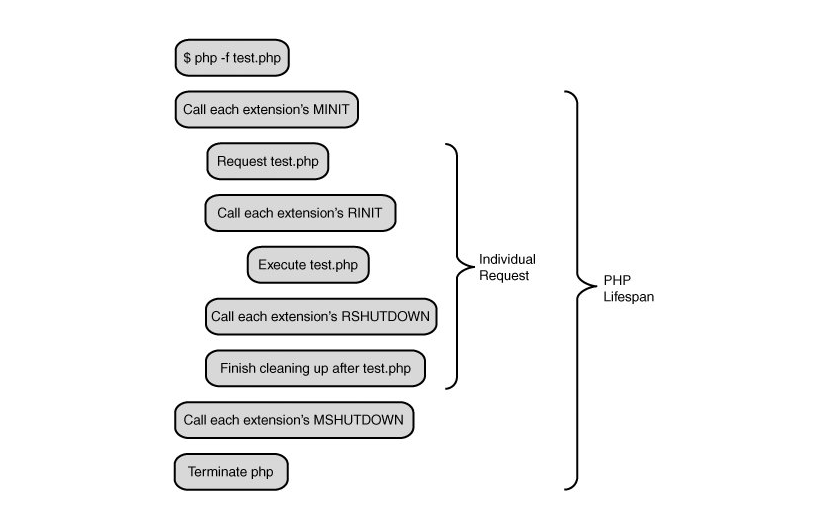
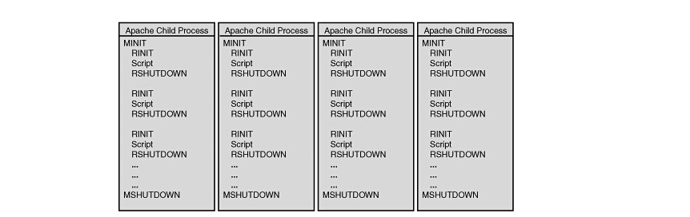
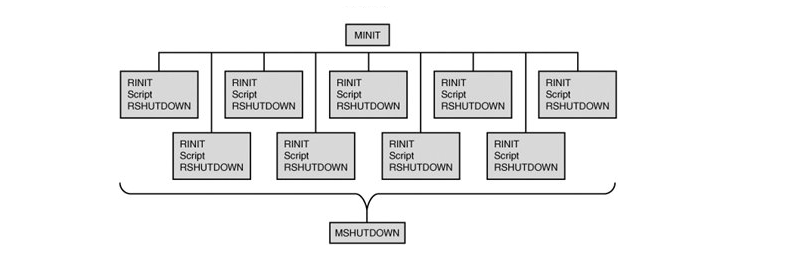

#### 一切开始：SAPI接口

SAPI 是Server Application Programming Interface 的简称，意思就是说，服务应用编程接口，PHP所有接口都是在这和系统进行交互。就像pc一样，无论安装在哪个系统，只要满足接口，都是可以正常运行的。PHP的脚本有很多运行方式，大多数是运行在web服务器，比如Apache或者nginx，或者命令行（CLI），或者嵌入其他程序里。

<!--more-->

#### 开始和结束

PHP的开始和结束主要有两个阶段：**处理请求之前的开始**和**请求之后的结束阶段**。开始的阶段有两个过程：**模块初始化阶段**和**模块激活阶段**。

> *   模块初始化阶段是MINIT(module init)，是在整个SAPI的什么周期内**只会发生一次**。也就是在lamp的时候，当Apache启动后，就开始启动MINIT，或者lnmp，当php-fpm启动后，会进行该步骤。例如PHP注册了一些拓展，则在该阶段回调所有的MINIT函数。
> 
>     PHP_MINIT_FUNCTION(myphpextension)
>     {
>     // 注册常量或者类等初始化操作
>     return SUCCESS;    }
> 
> *   模块激活阶段RINIT也叫请求初始化阶段（request init），该过程发生在请求的阶段。例如，当通过url请求某个页面，则在请求之前会进行模块激活（RINIT请求开始）。请求到达之后PHP初始化执行脚本的基本环境，例如创建一个执行环境，包括保存PHP运行过程中变量名称和值内容的符号表，以及当前所有的函数以及类等信息的符号表。然后PHP会调用所有模块的RINIT函数
> 
>     PHP_RINIT_FUNCTION(myphpextension)
>     {
>     // 例如记录请求开始时间
>     // 随后在请求结束的时候记录结束时间。这样我们就能够记录下处理请求所花费的时间了
>     return SUCCESS;    }
> 
> *   请求处理到达结束阶段，一般是执行到程序末尾或者调用`exit()`或者`die()` ，PHP都将进入结束阶段。和开始阶段对应，结束阶段也会分为两环节，一个在请求结束后停用模块(RSHUTDOWN，对应RINIT)
> 
>     PHP_RSHUTDOWN_FUNCTION(myphpextension)
>     {
>     // 例如记录请求结束时间，并把相应的信息写入到日至文件中。
>     return SUCCESS;    }
> 
> *   另一个阶段是，所有的请求都已处理完毕，SAPI也准备关闭了， PHP调用每个扩展的MSHUTDOWN方法，这是各个模块最后一次释放内存的机会。（这个是对于CGI和CLI等SAPI，没有"下一个请求"，所以SAPI立刻开始关闭。）
> 
>     PHP_MSHUTDOWN_FUNCTION(extension_name) {    /* Free handlers and persistent memory etc */    return SUCCESS;    }
> 
>     这样，整个PHP生命周期就结束了。要注意的是，只有在服务器没有请求的情况下才会执行"启动第一步"和"关闭第二步"。

SAPI运行PHP都经过下面几个阶段:

*   **模块初始化阶段(Module init) **

    即调用每个拓展源码中的的PHP_MINIT_FUNCTION中的方法初始化模块,进行一些模块所需变量的申请,内存分配等。
*   **请求初始化阶段(Request init) **
即接受到客户端的请求后调用每个拓展的PHP_RINIT_FUNCTION中的方法,初始化PHP脚本的执行环境。
*   **执行PHP脚本**
*   **请求结束(Request Shutdown)**
这时候调用每个拓展的PHP_RSHUTDOWN_FUNCTION方法清理请求现场,并且ZE开始回收变量和内存。
*   **关闭模块(Module shutdown)**
Web服务器退出或者命令行脚本执行完毕退出会调用拓展源码中的PHP_MSHUTDOWN_FUNCTION 方法

#### 单进程SAPI生命周期

CLI/CGI模式的PHP属于单进程的SAPI模式。这类的请求在处理一次请求后就关闭。也就是只会经过如下几个环节： 开始 - 请求开始 - 请求关闭 - 结束 SAPI接口实现就完成了其生命周期。如图所示：

#### 多进程SAPI生命周期

通常PHP是编译为apache的一个模块来处理PHP请求。Apache一般会采用多进程模式， Apache启动后会fork出多个子进程，每个进程的内存空间独立，每个子进程都会经过开始和结束环节，不过每个进程的开始阶段只在进程fork出来以来后进行，在整个进程的生命周期内可能会处理多个请求。只有在Apache关闭或者进程被结束之后才会进行关闭阶段，在这两个阶段之间会随着每个请求重复请求开始-请求关闭的环节。

#### 多线程的SAPI生命周期

多线程模式和多进程中的某个进程类似，不同的是在整个进程的生命周期内会并行的重复着 请求开始-请求关闭的环节.
在这种模式下，只有一个服务器进程在运行着，但会同时运行很多线程，这样可以减少一些资源开销，向Module init和Module shutdown就只需要运行一遍就行了，一些全局变量也只需要初始化一次，因为线程独具的特质，使得各个请求之间方便的共享一些数据成为可能。
