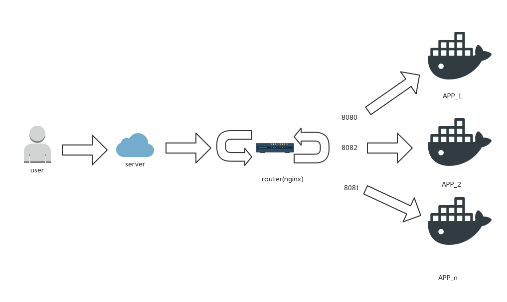

docker 名为容器。何为容器，也就是所谓的瓶子，罐子。用可以容纳东西的容器，不同容器之间互不影响。比如，一个瓶子装酒精，一个瓶子装水，非人为状态下，两个瓶子是没有关联的。

同样，docker也就是这个作用，每个docker可以作为叫做一个"瓶子"，每个"瓶子"可以当做PHP的运行环境，可以当做Java的运行环境。环境完全独立。外部的环境(内存，操作系统，CPU等)相当于柜子，承载着这些"瓶子"。

<!--more-->

上一篇博客记录的是比较简单的docker配置lnmp的过程。但是并不是一个正确的例子，虽然我没有线上使用docker的经验，但是以我来看，可以使用nginx作为前端机，然后配置外部机器的某个端口（如8080）映射到docker内部的某个端口（80），然后域名的请求转发到机器的8080端口，自然就到了docker内部了。

<!-- TOC -->

*   [获取lnmp镜像](#获取lnmp镜像)
*   [运行一个docker](#运行一个docker)
*   [进入该容器里面](#进入该容器里面)
*   [配置nginx](#配置nginx)
*   [配置MySQL](#配置mysql)
*   [找到WordPress项目，然后更改配置文件，改成mysql的账号密码和数据库 （略）](#找到wordpress项目然后更改配置文件改成mysql的账号密码和数据库-略)
*   [前端机nginx绑定域名，并且将请求转发到8080端口](#前端机nginx绑定域名并且将请求转发到8080端口)
*   [访问域名，测试是否正常](#访问域名测试是否正常)
*   [总结](#总结)
<!-- /TOC -->

#### 获取lnmp镜像

    $ docker search lnmp

    NAME                              DESCRIPTION                                     STARS     OFFICIAL   AUTOMATED
    imagine10255/centos6-lnmp-php56   centos6-lnmp-php56                              31                   [OK]
    twang2218/lnmp-nginx              这是 LNMP 示例中的 nginx 镜像                           9                    [OK]
    domainer/centos-lnmp                                                              5                    [OK]
    maxwhale/ubuntu14-lnmp1.2         Ubuntu14.04 lnmp1.2                             4                    [OK]
    dzer/lnmp                         lnmp环境                                          4
    maxwhale/lnmp-docker              LNMP Docker                                     4                    [OK]
    winstonpro/lnmp                   based on ubuntu 14.04                           3
    ...

    $ docker pull domainer/centos-lnmp
    latest: Pulling from domainer/centos-lnmp
    latest: Pulling from imagine10255/centos6-lnmp-php56
    f402e43879a8: Pull complete
    e76184b3b2ef: Extracting [==========>                                        ] 7.864 MB/36.8 MB
    c92be21ea534: Download complete
    ae5dfaaf3d26: Downloading [====================================>              ]  6.53 MB/8.989 MB
    ....
    Digest: sha256:a555d86ace933743c1c1f0373f16931a58dd737f889a04cfd8027e3eeb0c3c48
    Status: Downloaded newer image for domainer/centos-lnmp:latest

#### 运行一个docker

    $ docker run -d -v /etc/docker_nginx:/etc/nginx -v /tmp:/tmp -v /usr/share/docker_nginx:/usr/share/nginx -p 8080:80 --name my_blog domainer/centos-lnmp #外部端口8080映射到内部80端口 
    $ docker ps
    CONTAINER ID        IMAGE                  COMMAND             CREATED             STATUS              PORTS                          NAMES
    b9c310b6bf8a        domainer/centos-lnmp   "supervisord -n"    5 seconds ago       Up 4 seconds        22/tcp, 0.0.0.0:8080->80/tcp   my_blog

#### 进入该容器里面

    $ docker exec -ti my_blog /bin/bash ## 进入容器
    [root@3f2505bc3bd5 nginx]# yum update ## 更新源，然后启动各个服务
    [root@3f2505bc3bd5 nginx]# /etc/init.d/nginx start
    Starting nginx:                                            [  OK  ]
    [root@3f2505bc3bd5 nginx]# /etc/init.d/mysqld start
    Starting mysqld:                                           [  OK  ]
    [root@3f2505bc3bd5 nginx]# /etc/init.d/php-fpm start
    Starting php-fpm:                                          [  OK  ]

#### 配置nginx

    $ docker exec -ti 3f2505bc3bd5 /bin/bash
    [root@3f2505bc3bd5 nginx]# cd /etc/nginx/conf.d/
    [root@3f2505bc3bd5 nginx]# vim blog.conf

    server {
            listen 80;
            root /usr/share/nginx/wordpress;
            index index.php index.html index.htm index.nginx-debian.html;

            location ~ \.php$ {
                    fastcgi_pass 127.0.0.1:9000;
                    fastcgi_index  index.php;
                    set $path_info "";
                    set $real_script_name $fastcgi_script_name;
                    fastcgi_param  SCRIPT_FILENAME  $document_root$fastcgi_script_na
    me;
                    include        fastcgi_params;

            }
    }

#### 配置MySQL

先将外部的MySQL导出来，放到 /tmp目录下，因为之前/tmp 映射到了容器内部

    mysqldump -hlocalhost -uroot -pYOUR_PASSWORD wordpress > /tmp/wordpress.sql

登录容器内部，导入MySQL

    $ docker exec -ti 3f2505bc3bd5 /bin/bash
    $ mysql -uroot -pSlightech602 < wordpress.sql

如果出现`Unknown collation: 'utf8mb4_unicode_520_ci'` 只需要把`utf8mb4_unicode_520_ci`替换成`utf8_general_ci`
如果出现`Unknown collation: 'utf8mb4'` 只需要把`utf8mb4`替换成`utf8`

#### 找到WordPress项目，然后更改配置文件，改成mysql的账号密码和数据库 （略）

#### 前端机nginx绑定域名，并且将请求转发到8080端口

    upstream docker0 {
        server 127.0.0.1:8080;
    }

    server {
        listen 80;
        server_name test.feilong.tech;
        root /usr/share/docker_nginx/wordpress;
        index index.php index.html index.htm index.nginx-debian.html;

        location / {
            proxy_pass http://docker0;
        }
    }

#### 访问域名，测试是否正常

test.feilong.tech

#### 总结

可能实际线上的情景非常复杂，因为很多大厂会有几百个docker实例，以及完善的监控机制，以上也是一个比较简单的demo罢了。