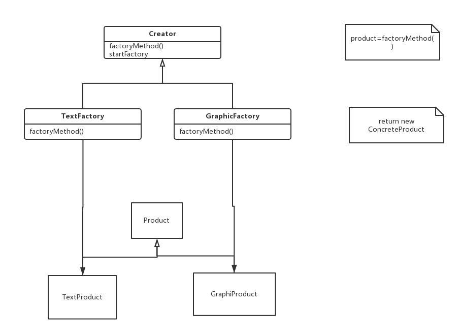

工厂模式就是创建"某种东西"。对于工厂模式，要创建的是一个"产品"，这个产品与创建它的类之间不存在绑定。实际上，为了保持这种松耦合，客户会通过一个工厂发出请求，再由工厂创建请求的产品。

## 何时使用工厂方法

如果一个类要创建的对象数目固定，而且已知，name构建这个类时，就可以采用一种可以预测的方式创建制定数目的对象。例如，如果你要开发一个世界的地图应用，由不同的对象表示七大洲，可以肯定的是，这些对象不会改变。另一方面，如果你要为不同种类的昆虫创建一个网站，肯定会不断发现新的昆虫，或者有些昆虫会有改变，还有可能某些品种会在短时间内灭绝。要处理这种变化，程序必须充分的灵活性。这种项目就可以考虑使用工厂模式。

## 优势

我感觉工厂模式的最大优势在于封装，把对象相互隔离，没有影响。

## 最简单的例子

### 工厂

第一步是建立工厂。我们使用一个抽象类Creator作为接口。

    <?php
    // Creator
    abstract class Creator {

        protected abstract function factoryMethod();

        public function startFactory() {
            $mfg  = $this->factoryMethod();
            return $mfg;
        }
    }

第二步是集成实现这个接口。我使用了两个子类来实现接口的方法。

    <?php
    //TextFactory.php
    include_once 'Creator.php';
    include_once 'TextProduct.php';

    class TextFactory extends Creator {

        protected function factoryMethod() {
            $product = new TextProduct();
            return $product->getProperties();
        }

    }

    <?php
    // GraphicFactory
    include_once 'Creator.php';
    include_once 'GraphicProduct.php';

    class GraphicFactory extends Creator {

        protected function factoryMethod() {
            $product = new GraphicProduct();
            return $product->getProperties();
        }
    }

### 产品

工厂模式的第二个接口就是产品，其实"产品"这个含义是相对于"工厂"的概念，并不一定是实实在在的产品，比如，我们可以把人当初产品等等。

    <?php
    interface Product {
        public function getProperties();
    }

同样的，我们再使用两个子类分别继承实现Product的属性。这里有两个"产品"，分别是 图像 和 文字，但是两个"产品"的属性是不一样的。

    <?php
    //GraphicProduct
    include_once 'Product.php';
    class GraphicProduct implements Product {

        private $mfgProduct;

        public function getProperties() {
            $this->mfgProduct = "This is a graphic.";
            return $this->mfgProduct;
        }

    }

    <?php
    // TextProduct
    include_once 'Product.php';
    class TextProduct implements Product {

        private $mfgProduct;

        public function getProperties() {
            $this->mfgProduct = "This is a text .";
            return $this->mfgProduct;
        }
    }

### 客户

客户就是指代码运行结果的显示终端，也就是所说的客户端了

    <?php
    include_once 'GraphicFactory.php';
    include_once 'TextFactory.php';

    class Client {
        private $someGraphicObject;
        private $someTextObject;

        public function __construct() {
            $this->someGraphicObject = new GraphicFactory();
            echo $this->someGraphicObject->startFactory() . "\n";
            $this->someTextProduct = new TextFactory();
            echo $this->someTextProduct->startFactory() . "\n";
        }

    }
    $worker = new Client();

### 代码运行

    feilongdeMBP:Factory feilong$ php Client.php
    This is a graphic.
    This is a text

## 参考资料

*   Learning PHP设计模式

## 附件

*   [PHP工厂模式demo](http://feilong.tech/wp-content/uploads/2018/01/Factory.zip)