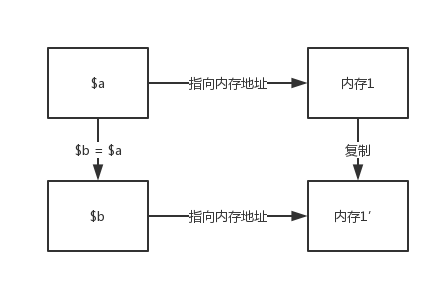

#### C/C++的内存管理

C/C++想要在堆上面分配内存，需要手动进行内存的分配和释放，变量管理非常的麻烦和繁琐，稍有不慎，就可能会造成内存上的错误使用。现在的一些高级语言，都普遍实行自动GC机制。

#### 自己的意淫

我们自己先思考下实行自动GC的方法，当我们定义一个变量的时候，给变量分配一块内存，用于保存zval和value的值，等到函数返回的时候，再讲内存回收。如果将变量赋值给其他变量的时候，再进行内存的复制，变量之间相互独立，互不影响。

#### PHP的内存管理

PHP的内存管理肯定不会像是我们想象的那么简单，如果那么简单，那该要浪费多少内存。PHP的内存管理是采用：**引用计数+写时复制** 的方法。

#### 引用计数

引用计数是指会有多少个zval指向同一个zend_value。当把变量赋值给一个新的变量的时候，引用计数就会+1。PHP7是将引用计数保存到了zval的结构中。

    //php7
    typedef union _zend_value {
        zend_long         lval;             /* long value */
        double            dval;             /* double value */
        zend_refcounted  *counted;  // 引用计数
        zend_string      *str;
        zend_array       *arr;
        zend_object      *obj;
        zend_resource    *res;
        zend_reference   *ref;
        zend_ast_ref     *ast;
        zval             *zv;
        void             *ptr;
        zend_class_entry *ce;
        zend_function    *func;
        struct {
            uint32_t w1;
            uint32_t w2;
        } ww;
    } zend_value;

PHP5是把引用计数放到了zend_struct里面

    struct _zval_struct {
        /* Variable information */
        zvalue_value value;     /* value */
        zend_uint refcount__gc; //引用计数
        zend_uchar type;    /* active type */
        zend_uchar is_ref__gc;
    };

PHP5不是这篇文章的重点，暂且不说。

下面我们看下PHP7 `zend_refcounted`具体的结构

    typedef struct _zend_refcounted_h {
        uint32_t         refcount;          /* reference counter 32-bit */
        union {
            struct {
                ZEND_ENDIAN_LOHI_3(
                    zend_uchar    type,
                    zend_uchar    flags,    /* used for strings & objects */
                    uint16_t      gc_info)  /* keeps GC root number (or 0) and color */
            } v;
            uint32_t type_info;
        } u;
    } zend_refcounted_h;

    struct _zend_refcounted {
        zend_refcounted_h gc;
    };

很明显，`refcount`字段使用了进行计数操作的。
举个例子来看看：

    <?php
    $a = array();
    echo xdebug_debug_zval('a');
    $b = $a;
    echo xdebug_debug_zval('a');
    $c = $b;
    echo xdebug_debug_zval('a');
    unset($c);
    echo xdebug_debug_zval('a');
    ?>

运行结果如下：
a: (refcount=1, is_ref=0)=array ()
a: (refcount=2, is_ref=0)=array ()
a: (refcount=3, is_ref=0)=array ()
a: (refcount=2, is_ref=0)=array ()

就像代码运行结果一样，首先定义了一个变量a，引用给数组分配了一块空间，引用计数为1，然后把a赋值给变量b，引用计数+1，然后赋值给变量c，继续+1，然后把变量c释放，引用计数-1。

但是，并不是所有的变量都会使用引用计数。**比如整形，浮点型，布尔型，NULL，他们的值是直接保存在zval中，所以他们的引用计数是0。这个也是PHP5和PHP7的一个不同点。**

举例说明：

    <?php
    $a = 123;
    echo xdebug_debug_zval('a');
    $b = $a;
    echo xdebug_debug_zval('a');
    ?>

PHP5
a: (refcount=1, is_ref=0)=123
a: (refcount=2, is_ref=0)=123

PHP7
a: (refcount=0, is_ref=0)=123
a: (refcount=0, is_ref=0)=123

#### 特殊情况

在PHP7中还有两种特殊的情况

举例说明：

    <?php
    $a = "hi";
    $b = $a;
    $c = $a;
    xdebug_debug_zval('a');
    ?>

PHP7
a: (refcount=0, is_ref=0)='hi'

    <?php
    $a = "hi".time();
    $b = $a;
    $c = $a;
    xdebug_debug_zval('a');
    ?>

PHP7
a: (refcount=3, is_ref=0)='hi1516202718'

wtf，为什么这两个是不一样的？这就是另外的特殊情况了。

*   在PHP中，函数名、类名、变量名、静态字符串等这种类型，比如第一个例子`$a = "hi"`，后面的字符串是唯一不变的，这等同于C语言中的`char *a = "hi"`，这些字符串是整个请求周期，请求结束后，同意销毁，自然不用引用计数来进行管理。
*   不可变数组，这是opcache的一种优化类型，这里不做详细说明。

#### 总结

引用计数算是PHP7和PHP5的一个重要的变更，这个也是内存的一个优化的地方。
在PHP5中，引用计数是在zval中，而不是在zend_value中，这样一来，导致变量复制的时候要复制两个结构(zval和zend_value)，PHP7将引用计数放到zend_value中，这样就可以进行公用，设计也更加合理。

#### 参考文献

*   《PHP7内核剖析》