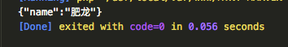
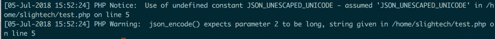

#### 背景

在工作期间，遇到一个关于json的问题，就是如果是中文，那么json就会自动将中文编码成Unicode，这样并不是说有问题，只是可读性大大降低。

之前遇到这个问题的时候，一直以为是在http传输过程中造成的，但是真是原因是由于json_encode的时候，中文自动被编码成了Unicode。

    $array = array(
        'name' => '肥龙'
    );
    echo json_encode($array);

执行结果:

#### PHP新特性

但是从`PHP5.4`之后，这个更新了一个新的json_encode的特性，是专门针对中文问题的。那就是增加新特性--JSON_UNESCAPED_UNICODE。

    $array = array(
        'name' => '肥龙'
    );
    echo json_encode($array, JSON_UNESCAPED_UNICODE);

执行结果：

#### 总结

这个特性帮助我们编码更高可读性的json，但是这个特性是在PHP5.4之后才增加的，所以PHP5.3版本暂不支持，会提示` Use of undefined constant JSON_UNESCAPED_UNICODE`

#### 参考文献

*   [让Json更懂中文(JSON_UNESCAPED_UNICODE)](http://www.laruence.com/2011/10/10/2239.html)