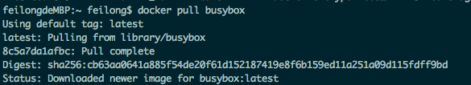
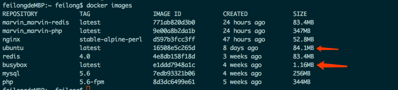
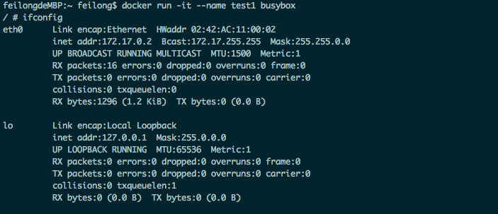
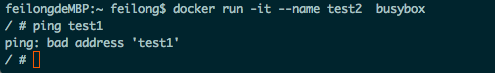
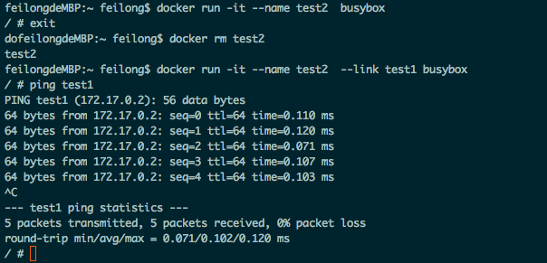

Docker功能可以说是非常强大，但是如果想要短时间掌握docker的使用，还是有一些难度的。之前有了解一些docker的知识，但是大多数都是囫囵吞枣。并没有从最基础的知识学起，所以现在想要系统的学习一下docker的知识。

### 通信的痛点

link的主要作用是实现不同容器之间的连接。
举个例子，我现在有个PHP的容器，我又创建了一个mysql的容器，这个时候，如果我想要使用PHP连接mysql的容器，最常规的方式就是通过ip连接。但是这样的话，如果mysql的容器一旦重启或者重新编译，那么ip就会有可能变动，我们就需要手动更改PHP容器内连接的ip，这样的维护成本太高了。
link的作用就是要解决这个痛点问题。

### link的实现

我们首先pull一个busybox的镜像，busybox是一个非常小巧的Linux镜像，占用的空间只有几MB，但是相比较Ubuntu的镜像，要小很多倍，而且也集成了很全的Linux命令

#### 创建test1容器

从截图中，我们可以看出test1的ip是172.17.0.2

#### 创建test2容器

我们需要新打开一个窗口，然后创建test2容器

这个时候我们ping test1的容器，是不能ping通的。

#### 使用link关联test1和test2

我们推出test2，删除test2容器，重新run一个容器

这个时候我们发现test2里面是可以通过别名test1去进行连接，

所以，比如test1里面运行了mysql，test2里面运行了PHP，那么，连接mysql的地方，完全可以把主机的地址写成test1

### 总结

使用link的作用显而易见，我们可以通过别名，直接让两个容器进行通信，使用容器名称通信的优势：

1.  不用担心ip的变动，因为name是唯一的
2.  极大的增加了可读性
3.  降低了运维成本