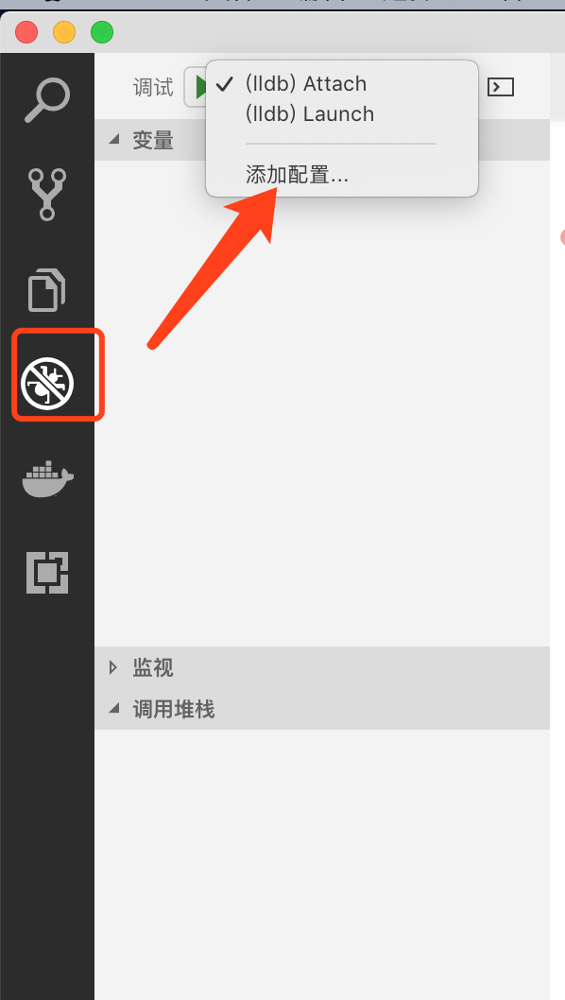
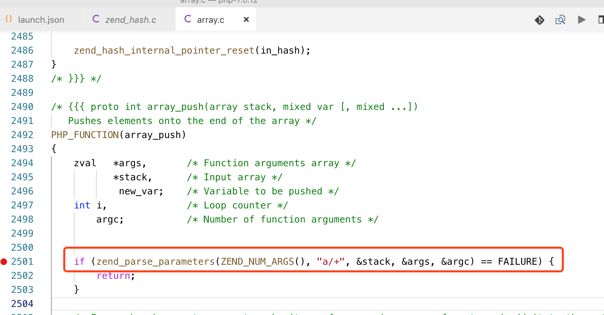
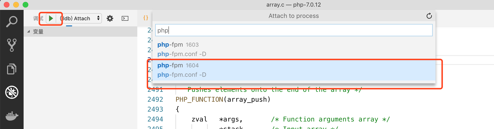
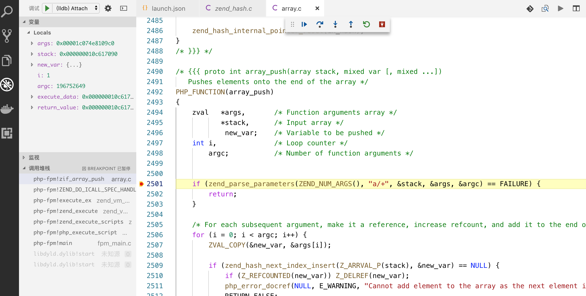

我是PHP的爱好者，大一下半年开始接触PHP到现在，已经有了几个年头，但是我不敢说自己"精通PHP"，因为我连PHP内核源码都还没看全，现在顶多停留在"熟悉"的层面。

我2018年买了一本《PHP7的内核剖析》，但是只是看了一些罢了。因为里面很多原理不太明白。如果真的要读懂一本书，尤其是技术相关，一定要手把手操作才能真正的理解！！！

但是自从装了几次PHP源码失败之后，就没有再尝试下去的决心了。书，也就仍在了一边，没有再看。

但是上次一个朋友分享了一篇文章《[程序员装逼被怼，决定用面试证明自己，结果...... ](https://mp.weixin.qq.com/s/SaT9jIxfnOw7htKoS8hedg)》，还是多少有一些小触动的。

所以，就再次拿起来书本，开始"啃骨头"。

## 1.安装PHP7源码

源码下载容易安装难！

自从上次几次失败之后，也多少总结一点小经验。

    $ ./configure --prefix=/usr/local/php7 --enable-debug --enable-fpm #生成Makefile

如果没有configure命令，需要使用buildconf生成一下

    $ ./buildconf --force 

出现了报错

    checking for libiconv... no
    configure: error: Please specify the install prefix of iconv with --with-iconv=<DIR></pre>
    <pre class="prettyprint">$ brew install libiconv
    $ ./configure --prefix=/usr/local/php7 --enable-debug --enable-fpm --with-iconv=/usr/local/opt/libiconv
    ...
    Generating files
    configure: creating ./config.status
    creating main/internal_functions.c
    creating main/internal_functions_cli.c
    +--------------------------------------------------------------------+
    ' License:                                                           '
    ' This software is subject to the PHP License, available in this     '
    ' distribution in the file LICENSE.  By continuing this installation '
    ' process, you are bound by the terms of this license agreement.     '
    ' If you do not agree with the terms of this license, you must abort '
    ' the installation process at this point.                            '
    +--------------------------------------------------------------------+

    Thank you for using PHP.

    config.status: creating php7.spec
    config.status: creating main/build-defs.h
    config.status: creating scripts/phpize
    config.status: creating scripts/man1/phpize.1
    config.status: creating scripts/php-config
    config.status: creating scripts/man1/php-config.1
    config.status: creating sapi/cli/php.1
    config.status: creating sapi/fpm/php-fpm.conf
    config.status: creating sapi/fpm/www.conf
    config.status: creating sapi/fpm/init.d.php-fpm
    config.status: creating sapi/fpm/php-fpm.service
    config.status: creating sapi/fpm/php-fpm.8
    config.status: creating sapi/fpm/status.html
    config.status: creating sapi/cgi/php-cgi.1
    config.status: creating ext/phar/phar.1
    config.status: creating ext/phar/phar.phar.1
    config.status: creating main/php_config.h
    config.status: executing default commands
    $ make #编译
    $ make install #安装</pre>

## 2. 配置lnmp

配置lnmp的步骤就不再多说了

## 3. 更改www.conf

安装源码之后的bin文件，会都保存到/usr/local/php7文件夹下面，PHP-fpm的配置文件也是一样。

    $ ll
    total 472
    -rwxrwxrwx  1 root  wheel   1271 Feb 21 22:44 pear.conf
    -rwxrwxrwx  1 root  wheel   4465 Feb 21 23:25 php-fpm.conf
    -rwxrwxrwx  1 root  wheel   4465 Feb 21 22:44 php-fpm.conf.default
    drwxrwxrwx  4 root  wheel    128 Feb 24 00:27 php-fpm.d
    -rwxrwxrwx@ 1 root  wheel  69724 Feb 22 08:07 php.ini
    -rwxrwxrwx@ 1 root  wheel  69692 Feb 22 08:06 php.ini-development
    -rwxrwxrwx@ 1 root  wheel  69724 Feb 22 08:06 php.ini-production

我们是想要通过web的方式，调试源码的运行过程。

大家知道，PHP-fpm是基于多进程的，我们在使用VS Code进行调试的时候，会需要选择挂起的进程号（下面会后响应的步骤说明）。所以，我们最好能够只有一个php-fpm的子进程，这样，就能确保选择的进程，能正常停顿到断点位置。

    ....

    ;pm = dynamic
    pm = static

    .....

    pm.max_children = 1

## 4. 配置调试文件

添加配置，使用attach的方式

    {
        // 使用 IntelliSense 了解相关属性。 
        // 悬停以查看现有属性的描述。
        // 欲了解更多信息，请访问: https://go.microsoft.com/fwlink/?linkid=830387
        "version": "0.2.0",
        "configurations": [{
                "name": "(lldb) Attach",
                "type": "cppdbg",
                "request": "attach",
                "program": "/usr/local/php7/sbin/php-fpm",
                "processId": "${command:pickProcess}",
                "MIMode": "lldb"
            }
        ]
    }

## 5. 运行测试

我就以数组的PHP代码文件为例，进行测试。

在nginx的项目目录里面创建一个测试文件。比如 a.php

    <?php
    $arr = [1,2,3,4,5];
    array_push($arr, 10, 20);
    var_dump($arr);

我们在源码文件 ext/standard/array.c里面加个断点

开始进行调试

我们再选择进程号的时候，需要选择大的进程号，因为小进程号主要是php-fpm主进程，主进程是用来管理子进程的，子进程才是正在进行执行代码的进程

然后访问a.php文件

[http://localhost/a.php](http://localhost/a.php)

侧边栏显示了调用的堆栈信息，以及传入的参数信息。